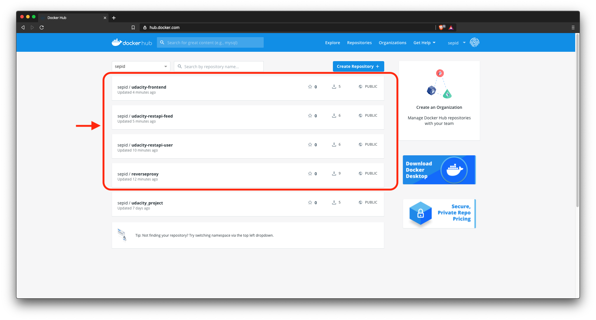
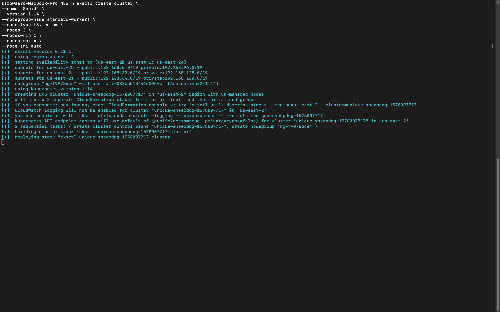
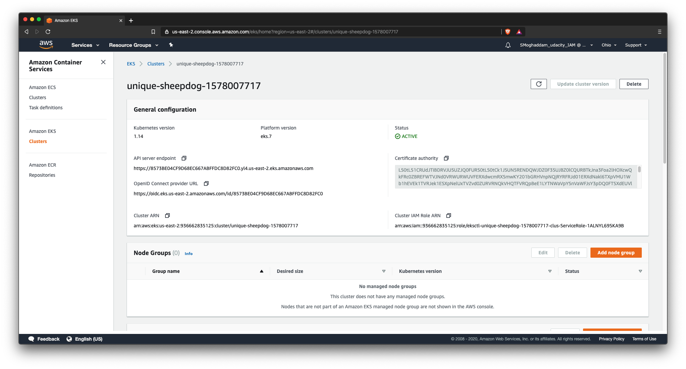
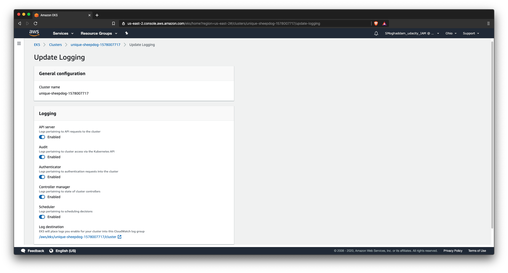
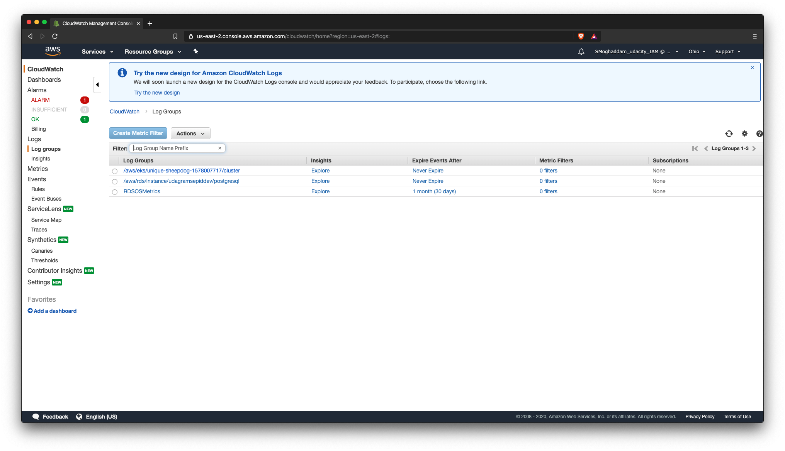
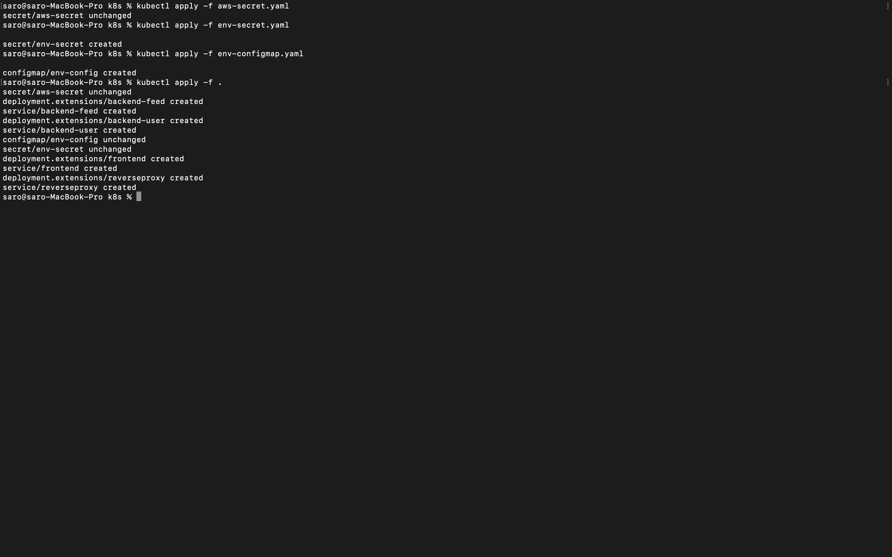
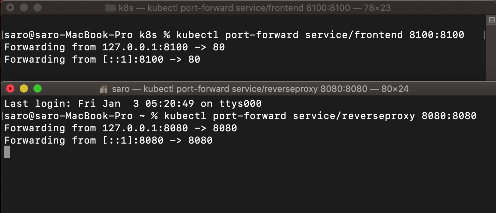
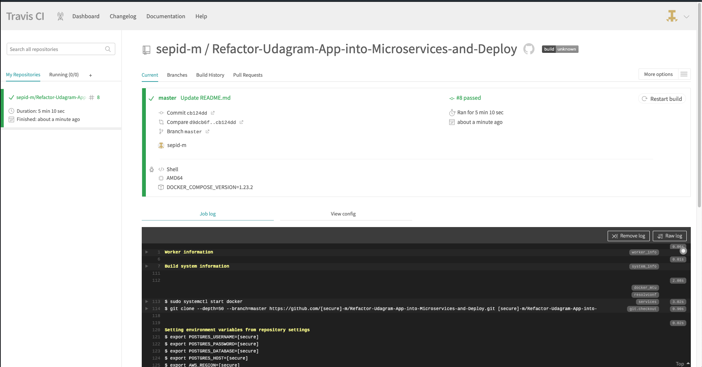

# Refactor Udagram App into Microservices and Deploy.
> Udacity Cloud Developer Nanodegree
By Sepid M.

Udagram is a simple cloud application developed alongside the Udacity Cloud Engineering Nanodegree. It allows users to register and log into a web client, post photos to the feed, and process photos using an image filtering microservice.

### Prerequisites
  
[Docker](https://docs.docker.com/docker-for-windows/install/)  
[AWS CLI](https://docs.aws.amazon.com/cli/latest/userguide/install-linux.html)  
[Eksctl](https://docs.aws.amazon.com/eks/latest/userguide/getting-started-eksctl.html)  
[AWS-iam-authenticator](https://docs.aws.amazon.com/eks/latest/userguide/install-aws-iam-authenticator.html)  
[Kubectl](https://docs.aws.amazon.com/eks/latest/userguide/install-kubectl.html)  


### Setup Docker Enviroment
Build the images: 
`docker-compose -f docker-compose-build.yaml build --parallel`   
  
List your docker images to check if they have been built:
`docker images`  

Run your docker containers: 
`docker-compose up`  

To exit run `control + C`


Push your docker images:
 `dcoker-compose -f docker-compose-build.yaml push`  

Check your Docker Hub, if the images reach on there:




### Create a Kubernetes Cluster on Amazon EKS with eksctl
Copy and Paste the bash scripts bellow with your cluster name and configration variables:

```
eksctl create cluster \ 
--name "ClusterName" \
--version 1.14 \
--nodegroup-name standard-workers \
--node-type t3.medium \
--nodes 3 \
--nodes-min 1 \
--nodes-max 4 \
--node-ami auto
```

 

 ### Setup Kubernetes Environment

Load secret files:
- `kubectl apply -f aws-secret.yaml`
- `kubectl apply -f env-secret.yaml`
- `kubectl apply -f env-configmap.yaml`  

Apply all other yaml files:
- `kubectl apply -f .`

 

The application is monitored by Amazon CloudWatch, Amazon EKS control plane logging provides audit and diagnostic logs directly from the Amazon EKS control plane to CloudWatch Logs in your account. These logs make it easy for you to secure and run your cluster.

To Enabling Control Plane Logs:
1. Open the [Amazon-EKS](https://console.aws.amazon.com/eks/home#/clusters) console.
2. Choose the name of the cluster to display your cluster information.
3. Under Logging, choose Update.
4. For each individual log type, choose whether the log type should be Enabled or Disabled. By default, each log type is Disabled.
5. Choose Update to finish.



 





### Check your Pods Status

`kubectl get all`  

 

### Connect the Services with Port Forwarding

Use Port Forwarding to the Frontend and Reverse Proxy services:
> Note: The port forwarding must be done in Separate terminals, to run both servises at the same time.

`kubectl port-forward service/frontend 8100:8100`  
`kubectl port-forward service/reverseproxy 8080:8080`  

 

### CI/CD with TravisCL
- Sign up for [TravisCL](https://travis-ci.com) and connect your Github application repository to TrivisCL.
- Add `.travis.yml` file to the root of the application.
- Copy and paste the following code into your `.travis.yml` file:
```
language: minimal

services: docker

env:
  - DOCKER_COMPOSE_VERSION=1.23.2

before_install:
  - docker -v && docker-compose -v
  - sudo rm /usr/local/bin/docker-compose
  - curl -L https://github.com/docker/compose/releases/download/${DOCKER_COMPOSE_VERSION}/docker-compose-`uname -s`-`uname -m` > docker-compose
  - chmod +x docker-compose
  - sudo mv docker-compose /usr/local/bin
  - curl -LO https://storage.googleapis.com/kubernetes-release/release/$(curl -s https://storage.googleapis.com/kubernetes-release/release/stable.txt)/bin/linux/amd64/kubectl
  - chmod +x ./kubectl
  - sudo mv ./kubectl /usr/local/bin/kubectl

install:
  - docker-compose -f udacity-c3-deployment/docker/docker-compose-build.yaml build --parallel 
```  
- Add your environment variables to the project repository in [TravisCL](https://travis-ci.com) by selecting the setting option.

- Commit and Push your changes to trigger a Travis CI build.
> Travis only runs builds on the commits you push after you’ve added a `.travis.yml` file.

- Check the build status page to see if your build passes or fails according to the return status of the build command by visiting [TravisCL](https://travis-ci.com) and selecting your repository.

 